# CodiLay — Persistent Settings & Interactive Menu

## What Changed

CodiLay is now a **full interactive application**, not just a one-time CLI tool. Here's what was added:

---

### 🔑 Persistent API Key Storage
> [!IMPORTANT]
> API keys are now stored in `~/.codilay/settings.json` — **no more `export` commands!**

Keys persist across terminal sessions, restarts, and new terminal windows. The settings file is automatically created when you first configure CodiLay.

### 🖥️ Interactive Menu
Running `codilay` (no arguments) launches a full interactive menu:

```
   ██████╗ ██████╗ ██████╗ ██╗   ██╗██╗      █████╗ ██╗   ██╗
  ██╔════╝██╔═══██╗██╔══██╗╚██╗ ██╔╝██║     ██╔══██╗╚██╗ ██╔╝
  ...

  [1] 📝  Document a codebase
  [2] ⚙️   Setup / First-time configuration
  [3] 🔑  Manage API keys
  [4] 🤖  Change provider & model
  [5] 🔧  Preferences
  [6] 📊  View current settings
  [7] ❓  Help
  [0] 🚪  Exit
```

---

## New Files

| File | Purpose |
|------|---------|
| [settings.py](file:///Users/harmanpreetsingh/Public/Code/codedoc/src/codilay/settings.py) | Persistent settings store (`~/.codilay/settings.json`) |
| [menu.py](file:///Users/harmanpreetsingh/Public/Code/codedoc/src/codilay/menu.py) | Interactive menu system with Rich UI |

## Modified Files

| File | Changes |
|------|---------|
| [cli.py](file:///Users/harmanpreetsingh/Public/Code/codedoc/src/codilay/cli.py) | Settings integration, smart routing, new subcommands |

---

## New CLI Commands

| Command | What it does |
|---------|--------------|
| `codilay` | Launches interactive menu |
| `codilay setup` | First-time setup wizard (provider, API key, model) |
| `codilay config` | View all current settings |
| `codilay keys` | Add, view, or remove stored API keys |

## Existing Commands (unchanged)

| Command | What it does |
|---------|--------------|
| `codilay .` | Document current directory |
| `codilay /path` | Document a specific project |
| `codilay . -p openai` | Use a specific provider |
| `codilay status .` | Show doc status |
| `codilay diff .` | Show what changed |
| `codilay clean .` | Remove generated files |
| `codilay init .` | Create config file |

---

## Architecture

```mermaid
graph TD
    A[codilay CLI] -->|no args| B[Interactive Menu]
    A -->|path arg| C[run command]
    A -->|setup| D[Setup Wizard]
    A -->|config| E[View Settings]
    A -->|keys| F[Manage API Keys]
    
    B --> G[~/.codilay/settings.json]
    D --> G
    F --> G
    
    G -->|inject_env_vars| H[Environment Variables]
    H --> I[LLM Client]
    
    style G fill:#2d5016,stroke:#4ade80
    style B fill:#1e3a5f,stroke:#60a5fa
```



> [!TIP]
> The old `export ANTHROPIC_API_KEY=...` method **still works** as a fallback. Stored keys take priority, then environment variables.
